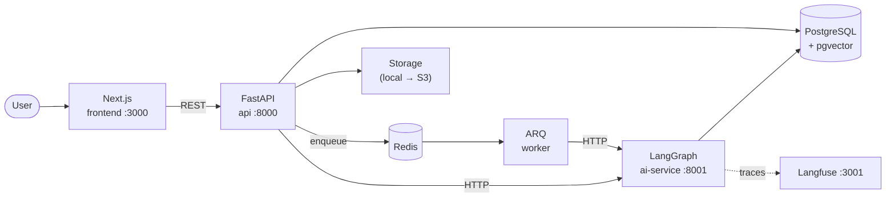

# AgentSDR

> An autonomous AI Sales Development Representative.

AgentSDR learns a company's business from its own documents, then finds, researches,
qualifies and writes to the prospects that business can actually help — and stops for a
human before anything is sent.

It is not an email generator. The intelligence comes from holding **two** models of the
world at once — *what we sell* and *what this prospect needs* — and deciding whether a
real opportunity exists between them.

**Status:** Phase 1 — foundation. No business logic yet.

---

## Architecture



**Why these boundaries**

| Service | Owns | Why it is separate |
|---|---|---|
| `frontend` | UI, chat, approvals | Deploys independently; never talks to the DB |
| `api` | HTTP contract, database, files, jobs | The only writer to Postgres — one place to add auth and tenancy later |
| `ai-service` | Agents, prompts, tools, RAG, LLM providers | Slow, GPU-ish, dependency-heavy. Restarting it must not drop HTTP traffic |
| `worker` | Long jobs (research, enrichment, sending) | Prospecting 100 companies cannot happen inside a request |

The worker calls `ai-service` over **HTTP, not imports**. That keeps the dependency
one-directional and lets either side scale or crash alone.

Full reasoning, the multi-tenancy upgrade path, and per-agent design:
[docs/ARCHITECTURE.md](docs/ARCHITECTURE.md).

---

## Quick start

Prerequisites: Docker Desktop, Node 22.13+, Git.

```bash
cp .env.example .env
# fill in the three Langfuse secrets:
#   openssl rand -hex 32   (run it three times)

docker compose up --build          # postgres, redis, langfuse, api, ai-service, worker

cd apps/frontend
cp .env.local.example .env.local
npm install
npm run dev
```

| What | Where |
|---|---|
| Frontend | http://localhost:3000 |
| API docs | http://localhost:8000/docs |
| API readiness | http://localhost:8000/api/v1/health/ready |
| AI service | http://localhost:8001/health |
| Langfuse | http://localhost:3001 |

The home page polls the API's readiness endpoint. If Postgres and Redis both read `ok`,
the whole stack is wired correctly.

Every port is an env var (`API_PORT`, `REDIS_PORT`, …). Change them in `.env` if another
project on your machine already owns the defaults — and update `NEXT_PUBLIC_API_URL` to
match.

---

## Layout

```
ai-lead-generator/
├── apps/
│   ├── frontend/      Next.js 16 · TypeScript · Tailwind v4 · shadcn/ui · TanStack Query
│   ├── api/           FastAPI · SQLAlchemy 2 (async) · Alembic · owns the database
│   ├── ai-service/    LangGraph · LangChain · pgvector RAG · Langfuse
│   └── worker/        ARQ background jobs
├── packages/
│   └── shared/        Settings base + structured logging, used by all three Python apps
├── infra/postgres/    First-boot SQL (pgvector extension, langfuse database)
├── docs/              Architecture and decisions
├── storage/           Uploaded files (git-ignored; S3 later)
└── docker-compose.yml
```

---

## Development

```bash
# Python (inside the containers)
docker compose exec api pytest
docker compose exec api ruff check .
docker compose exec api ruff format .

# Database
docker compose exec api alembic upgrade head
docker compose exec api alembic revision --autogenerate -m "add x"
docker compose exec api alembic check          # do the models and the DB agree?
docker compose exec api alembic downgrade -1

# Frontend
cd apps/frontend
npm run lint
npm run build
npx prettier --write .

# Logs
docker compose logs -f api ai-service worker
```

**Conventions**

- Branches `feat/…`, `fix/…`, `chore/…`; commits follow [Conventional Commits](https://www.conventionalcommits.org).
- Python: async everywhere, Pydantic at every boundary, type hints are not optional. Ruff is the linter *and* the formatter.
- Never `print` — use `get_logger(__name__)` from `shared` and log key/value pairs.
- Secrets only in `.env`. If a value differs between machines, it is an env var.
- The frontend is not in `docker-compose`: Next.js hot reload over a Windows bind mount is slow. `apps/frontend/Dockerfile` covers production.

## Stack

Next.js · TypeScript · Tailwind · shadcn/ui · TanStack Query · Zustand · FastAPI · Python 3.12 ·
LangGraph · LangChain · PostgreSQL + pgvector · Redis + ARQ · SQLAlchemy · Langfuse ·
`all-MiniLM-L6-v2` local embeddings · Gemini / Groq / OpenRouter · Gmail SMTP / Resend

Everything runs free locally.

## License

MIT
